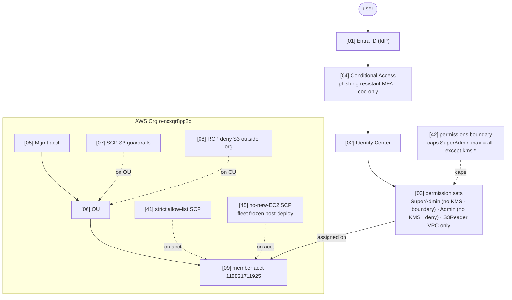
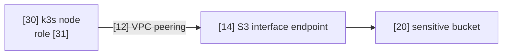
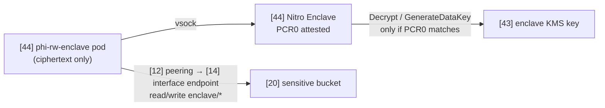
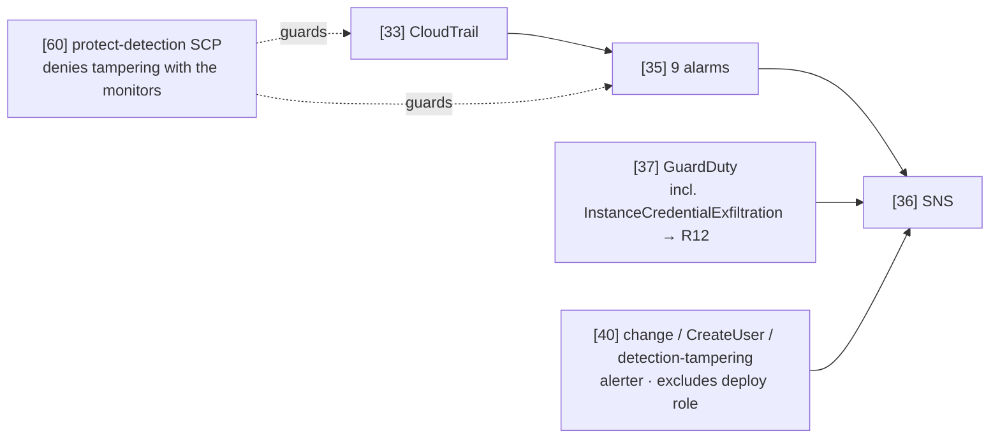

# Securing a Sensitive S3 Resource — AWS + Entra (Take-Home)

## Overview

**Login (AWS access portal):** **https://d-96677e53fe.awsapps.com/start/**

| Sign in with                     | Permission set   | Scope                                                                                                                                                                    | Password              |
| -------------------------------- | ---------------- | ------------------------------------------------------------------------------------------------------------------------------------------------------------------------ | --------------------- |
| `ith-superadmin@delicatehug.com` | `ITH-SuperAdmin` | everything **except KMS** — a permissions boundary [[42]](controls/42-permission-boundary.md) caps the max; account SCP [[41]](controls/41-account-scp.md) caps the rest | `Falcon-Ridge-7742!`  |
| `ith-admin@delicatehug.com`      | `ITH-Admin`      | relevant services, **`Deny kms:*`** (inline)                                                                                                                             | `Cobalt-Harbor-7742!` |
| `ith-s3@delicatehug.com`         | `ITH-S3Reader`   | read S3 **only inside the VPC**                                                                                                                                          | `Maple-Lagoon-7742!`  |

> **Two roles, no KMS — *different* mechanisms (the point of [[42]](controls/42-permission-boundary.md)):** `ITH-Admin` is denied KMS by an explicit **`Deny kms:*`** in its policy; `ITH-SuperAdmin` is denied KMS by a **permissions boundary** — a *ceiling* that caps the role's maximum to "everything except `kms:*`" with **no Deny at all**. Even `AdministratorAccess` (`Allow *`) can't reach KMS because the effective permission is `identity ∩ boundary`.

> Demo accounts only: no Entra-side privileges, scoped to the AWS app, and every action in the one ITH account is bounded by the strict allow-list SCP [[41]](controls/41-account-scp.md). 

> Only Path 3 allows detokenized values using PCR0 attested KMS keys(The key lives inside nitro enclave, not ec2, apps cant touch it.) KMS will only give that key to that enclave on that specific EC2. 


> **review this with an AI:** Download to local and ask ai about it.
---

## Key resources

Everything lives in **one account in one region** — copy/paste exact names from here.

| | |
|---|---|
| **Region** | `ap-southeast-1` — *all* resources. Calls from outside the VPC (your laptop / CloudShell) return `AccessDenied` **by design**. |
| **Account** | `ith-workload` — `118821711925` |
| **Sensitive bucket [[20]](controls/20-s3-sensitive.md)** | **`phi-sensitive-118821711925`** — full tokenized ePHI. VPC-locked (paths P2/P3/P4) or via the Object Lambda access point (P1); a human/laptop with no `vpce` is denied → use the EC2 UI. |
| **De-identified bucket** | `phi-deident-118821711925` — redacted copy, readable anywhere **in the org** (still TLS-only + KMS + org-locked). |
| **CloudTrail log bucket** | `ith-cloudtrail-118821711925` |
| **CloudTrail** | `ith-trail` — multi-region, log-file validation, management **+** S3 object-level (data) events on both buckets. |
| **CloudWatch alarms** | [console → CloudWatch → Alarms](https://ap-southeast-1.console.aws.amazon.com/cloudwatch/home?region=ap-southeast-1#alarmsV2:?~()) — filter by prefix **`ith-`**. 12 alarms total: 9 CIS-style [[35]](controls/35-alarms.md) + 3 change/CreateUser/detection-tampering [[40]](controls/40-change-alerter.md); the detection stack itself is locked by the protect-detection SCP [[60]](controls/60-protect-detection.md) (prevent + detect). |

> **Bucket naming — demo vs production:** S3 bucket names are **global** across all of AWS, so these demo buckets are namespaced with the account ID (`phi-sensitive-118821711925`) to stay unique. In **production**, fully account- **and** region-namespace them — `<name>-<account-id>-<region>-<rand>`, e.g. `phi-sensitive-118821711925-ap-southeast-1-an` — so the same stack can deploy per-region without name collisions, and a deleted bucket name can't be **sniped/squatted** by another account before you recreate it. (`-an` = a short random/nonce suffix.)

---

## Architecture

Every box carries a component ID `[NN]` → one page in [`controls/`](controls/README.md).

### Identity & governance



### Paths to the sensitive bucket [[20]](controls/20-s3-sensitive.md)

- **P1 — Lambda redactor** · *role: basic reader (IAM Function URL).* Returns non-sensitive fields only.


- **P2 — On-prem Kubernetes** · *role: on-prem node role [[31]](controls/31-onprem-role.md).* Across VPC peering to the interface endpoint.



- **P3 — EC2 web app (human path)** · *roles: all 3 admins via SSM; reads with EC2 role [[29]](controls/29-ec2-role.md).* The only way a human reads details.


- **P4 — `s3` user** · *role: s3 user role [[32]](controls/32-s3-reader-role.md).* CLI/SDK, allowed only from inside the VPC.


- **P5 — Attested enclave read/write** · *role: on-prem node role [[31]](controls/31-onprem-role.md), but gated by hardware attestation.* The on-prem node runs a **Nitro Enclave [[44]](controls/44-nitro-enclave.md)**; a pod reads **and writes** the bucket, but the crypto is gated by a KMS key [[43]](controls/43-enclave-kms-key.md) that unlocks **only** for the measured enclave image (PCR0). Even the node OS / its IAM role / root cannot decrypt — only the enclave can. Reuses P2's peering + interface endpoint; client-side envelope crypto happens inside the enclave.


### Detection & response



> **Watch the alarms live:** [console → CloudWatch → Alarms](https://ap-southeast-1.console.aws.amazon.com/cloudwatch/home?region=ap-southeast-1#alarmsV2:?~()) (filter by prefix `ith-`). Trip one yourself by running any *denied* command below as `ith-s3`, then refresh — the `ith-s3-access-denied` alarm flips to `ALARM`.

---
## Demo — try it yourself

The `aws ssm start-session` commands (paths P2/P3) need the **AWS CLI v2** *and* the **Session Manager plugin**. Without the plugin the CLI errors with `SessionManagerPlugin is not found`. Install it once on Windows (PowerShell):

```powershell
$u = "https://s3.amazonaws.com/session-manager-downloads/plugin/latest/windows/SessionManagerPluginSetup.exe"
$o = "$env:TEMP\SessionManagerPluginSetup.exe"
curl.exe -sSL -o $o $u ; Start-Process $o -Verb RunAs -Wait   # accept the UAC prompt
```

Official guide (incl. macOS/Linux): <https://docs.aws.amazon.com/systems-manager/latest/userguide/install-plugin-windows.html> — verify with `session-manager-plugin --version`.

> Your laptop / CloudShell are **outside the VPC**, so VPC-locked reads return `AccessDenied` *by design* — that's the control working, not a bug. All commands use region `ap-southeast-1`.

### Every command, once — who it works for

```bash
# ── P1 · basic-reader Lambda — returns NON-sensitive fields only
#    ✓ super · ✗ admin · ✗ s3 (lambda: not in their sets)
aws lambda invoke --function-name ith-redactor --payload '{"queryStringParameters":{"key":"patients/088047ea-5cf6-2dfd-3b89-c0c8a1813de8.json"}}' --cli-binary-format raw-in-base64-out --region ap-southeast-1 out.json && cat out.json

# ── P2 · full object across VPC peering via the S3 *interface* endpoint (read runs as node role [31], in-VPC)
#    ✓ super · – admin (not demoed) · ✗ s3 (no ssm:)
aws ssm start-session --target i-0303f39bf8f751014 --region ap-southeast-1          # SSM into the k3s node first…
aws s3api get-object --bucket phi-sensitive-118821711925 --key patients/088047ea-5cf6-2dfd-3b89-c0c8a1813de8.json --endpoint-url https://bucket.vpce-000ca0be99fa5595c-dkt1diqi.s3.ap-southeast-1.vpce.amazonaws.com --region ap-southeast-1 /tmp/p.json && head -c 300 /tmp/p.json   # …then, inside that session

# ── P3 · human read path — SSM port-forward to the EC2 web app, then open http://localhost:8080
#    ✓ super · ✓ admin · ✗ s3 (no ssm: in its set)
aws ssm start-session --target i-004a73751e979b264 --document-name AWS-StartPortForwardingSession --parameters "portNumber=8080,localPortNumber=8080" --region ap-southeast-1

# ── Detection · confirm the trail is logging + list all 12 alarms (9 CIS [35] + 3 change [40])
#    ✓ super · ✓ admin · ✗ s3 (no cloudwatch/cloudtrail in its set)
aws cloudtrail get-trail-status --name ith-trail --query IsLogging --region ap-southeast-1
aws cloudwatch describe-alarms --alarm-name-prefix ith- --query "MetricAlarms[].[AlarmName,StateValue]" --output text --region ap-southeast-1

```

### Denied by design — guardrails every identity hits

```bash
# ── KMS · one denial, two DIFFERENT levers — the whole point of [42]
#    ✗ super  → permissions boundary [42]: allowed set is "everything except kms:*" (NotAction, NO Deny).
#               Effective perm = identity ∩ boundary, so even AdministratorAccess (Allow *) can't reach kms:*.
#    ✗ admin  → explicit `Deny kms:*` in the permission set (same result, different mechanism)
#    ✗ s3     → kms: not in its set
aws kms list-aliases --region ap-southeast-1 --query "Aliases[?starts_with(AliasName, 'alias/ith/')].AliasName"

# ── Sensitive bucket read directly, no VPC — the bucket VPC-lock [20] denies EVERYONE, even super
#    ✗ super · ✗ admin · ✗ s3   (aws:sourceVpce gate — use P1/P2/P3 instead)
aws s3api get-object --bucket phi-sensitive-118821711925 --key patients/088047ea-5cf6-2dfd-3b89-c0c8a1813de8.json /tmp/x.json --region ap-southeast-1
aws s3 ls s3://phi-sensitive-118821711925/patients/ --region ap-southeast-1
#    …the SAME read SUCCEEDS once you're inside the VPC (this is P2) — read runs as the k3s node role [31]:
#    ✓ super · – admin (not demoed; admin reads via P3 web UI) · ✗ s3 (no ssm:)
aws ssm start-session --target i-0303f39bf8f751014 --region ap-southeast-1                                   # 1) SSM onto the k3s node = get inside the VPC
aws s3api get-object --bucket phi-sensitive-118821711925 --key patients/088047ea-5cf6-2dfd-3b89-c0c8a1813de8.json --endpoint-url https://bucket.vpce-000ca0be99fa5595c-dkt1diqi.s3.ap-southeast-1.vpce.amazonaws.com --region ap-southeast-1 /tmp/p.json && head -c 300 /tmp/p.json   # 2) through the interface endpoint → READ_OK

# ── Any service outside the demo allow-list — account SCP [41] caps even full admin
#    ✗ super (rds not in [41]; admin & s3 lack rds too)
aws rds describe-db-instances --region ap-southeast-1

# ── Launch a NEW EC2 instance — the fleet is frozen post-deploy by the no-new-EC2 SCP [45]
#    ✗ super · ✗ admin · ✗ s3   (RunInstances/Spot/Fleet denied for everyone but the IaC break-glass role)
#    --dry-run returns UnauthorizedOperation (the deny); without [45] it would say DryRunOperation.
aws ec2 run-instances --dry-run --image-id ami-0df7a207adb9748c7 --instance-type t3.micro --region ap-southeast-1
```

> **Watch a control fire:** every `AccessDenied` above is logged to CloudTrail. Run any denied call as `ith-s3`, then sign back in as `ith-admin` / `ith-superadmin` and re-run the `describe-alarms` command — the `ith-s3-access-denied` alarm [[35]](controls/35-alarms.md) flips to `ALARM`.

---
## Documentation

| Where | What |
|---|---|
| [`controls/`](controls/README.md) | consolidated controls + one page per component ID |
| [`controls/OutOfScopeNotes.md`](controls/OutOfScopeNotes.md) | Synthea, hardware-MFA (+ CA API JSON & how-to-verify), root protection (root-usage alert · centralize root access · multi-party approval), super-admin-only S3 (Config vs SCP), behavior/risk-based sign-in, tradeoffs |

---
*Synthetic data only (Synthea) — no real PHI. Isolated; destroyed after verdict.*
