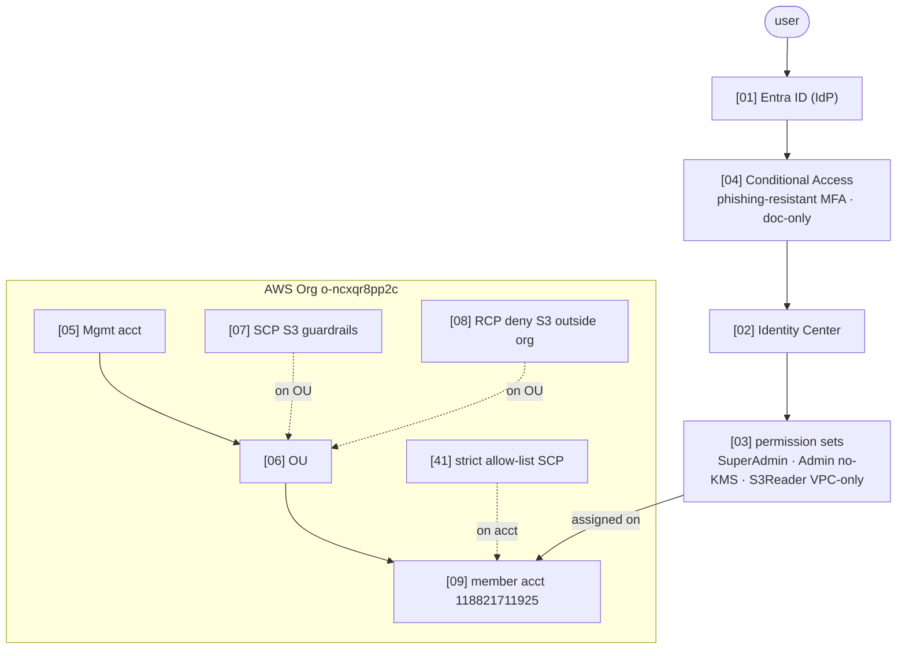
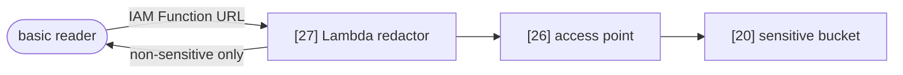
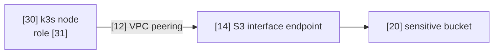
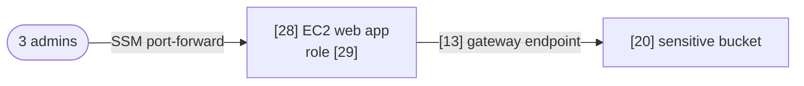
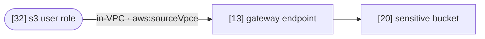
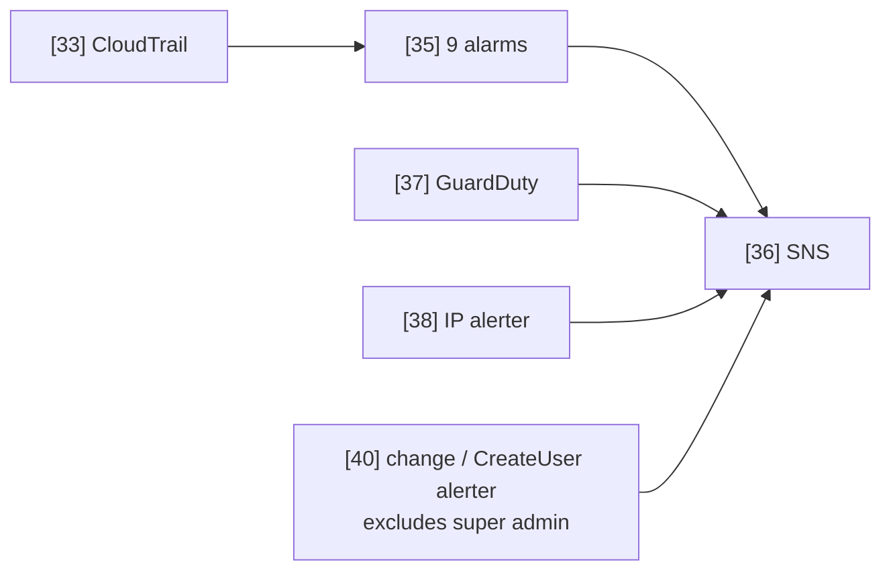

# Securing a Sensitive S3 Resource — AWS + Entra (Take-Home)

## Overview

**Login (AWS access portal):** **https://d-96677e53fe.awsapps.com/start/**

| Sign in with | Permission set | Scope | Password |
|---|---|---|---|
| `ith-superadmin@delicatehug.com` | `ITH-SuperAdmin` | everything (capped by account SCP [41]) | `Falcon-Ridge-7742!` |
| `ith-admin@delicatehug.com` | `ITH-Admin` | relevant services, **`Deny kms:*`** | `Cobalt-Harbor-7742!` |
| `ith-s3@delicatehug.com` | `ITH-S3Reader` | read S3 **only inside the VPC** | `Maple-Lagoon-7742!` |

> Demo accounts only: no Entra-side privileges, scoped to the AWS app, and every action in the one ITH account is bounded by the strict allow-list SCP [41]. 
---

## Architecture

Every box carries a component ID `[NN]` → one page in [`controls/`](controls/README.md).

### Identity & governance



### Paths to the sensitive bucket [20]

- **P1 — Lambda redactor** · *role: basic reader (IAM Function URL).* Returns non-sensitive fields only.



- **P2 — On-prem Kubernetes** · *role: on-prem node role [31].* Across VPC peering to the interface endpoint.



- **P3 — EC2 web app (human path)** · *roles: all 3 admins via SSM; reads with EC2 role [29].* The only way a human reads details.



- **P4 — `s3` user** · *role: s3 user role [32].* CLI/SDK, allowed only from inside the VPC.



### Detection & response



---

## Demo — try it yourself

Each login below maps to one permission set. Between them they exercise **all four paths (P1–P4)** plus detection. Everything is read-only/reversible — you can't break anything (the account allow-list SCP [41] caps even SuperAdmin).

**Get a session (any user) — console GUI, ~30s**

1. Sign in at **https://d-96677e53fe.awsapps.com/start/** with the user + password from the table at the top.
2. Expand the **`ith-workload` (118821711925)** account.
3. **Console:** click the permission-set name (e.g. `ITH-SuperAdmin`) to open the AWS console as that role.
4. **CLI:** click **Access keys** next to it → copy the env-var block for your shell → paste into your terminal. The commands below now run as that user.

> Your laptop / CloudShell are **outside the VPC**, so VPC-locked reads return `AccessDenied` *by design* — that's the control working, not a bug. All commands use region `ap-southeast-1`.

### 1. `ith-superadmin` — full admin (the only identity that can use every path)

**CAN do**

```bash
# P3 — human read path: SSM port-forward to the EC2 web app, then open http://localhost:8080
aws ssm start-session --target i-004a73751e979b264 --document-name AWS-StartPortForwardingSession --parameters "portNumber=8080,localPortNumber=8080" --region ap-southeast-1

# P1 — basic-reader Lambda returns NON-sensitive fields only
aws lambda invoke --function-name ith-redactor --payload '{"queryStringParameters":{"key":"patients/088047ea-5cf6-2dfd-3b89-c0c8a1813de8.json"}}' --cli-binary-format raw-in-base64-out --region ap-southeast-1 out.json
cat out.json

# P2 — full object across VPC peering via the S3 *interface* endpoint. SSM into the on-prem k3s node first:
aws ssm start-session --target i-08a03eb73f6aaef46 --region ap-southeast-1
#   then, inside that session (the node's CLI uses node role [31]):
aws s3api get-object --bucket phi-sensitive-118821711925 --key patients/088047ea-5cf6-2dfd-3b89-c0c8a1813de8.json --endpoint-url https://bucket.vpce-000ca0be99fa5595c-dkt1diqi.s3.ap-southeast-1.vpce.amazonaws.com --region ap-southeast-1 /tmp/p.json && head -c 300 /tmp/p.json

# KMS — the thing ITH-Admin can't: list the per-patient CMKs
aws kms list-aliases --region ap-southeast-1 --query "Aliases[?starts_with(AliasName, 'alias/ith/')].AliasName"

# Detection — confirm the trail is logging and see the 9 alarms
aws cloudtrail get-trail-status --name ith-trail --query IsLogging --region ap-southeast-1
aws cloudwatch describe-alarms --alarm-name-prefix ith- --query "MetricAlarms[].[AlarmName,StateValue]" --output text --region ap-southeast-1
```

**CAN'T do**

```bash
# Read the sensitive bucket directly as a human — VPC-lock [20] denies even SuperAdmin (use P3 instead)
aws s3api get-object --bucket phi-sensitive-118821711925 --key patients/088047ea-5cf6-2dfd-3b89-c0c8a1813de8.json /tmp/x.json --region ap-southeast-1   # AccessDenied

# Use any service outside the demo allow-list — account SCP [41] caps even full admin
aws rds describe-db-instances --region ap-southeast-1   # AccessDenied (rds not in [41])
```

### 2. `ith-admin` — scoped admin, **no KMS, no Lambda**

**CAN do**

```bash
# P3 — same human read path (SSM → EC2 web app), then open http://localhost:8080
aws ssm start-session --target i-004a73751e979b264 --document-name AWS-StartPortForwardingSession --parameters "portNumber=8080,localPortNumber=8080" --region ap-southeast-1

# Detection — read the alarms / trail / GuardDuty
aws cloudwatch describe-alarms --alarm-name-prefix ith- --query "MetricAlarms[].[AlarmName,StateValue]" --output text --region ap-southeast-1
```

**CAN'T do**

```bash
# Touch KMS at all — explicit Deny kms:* in the permission set
aws kms list-keys --region ap-southeast-1   # AccessDenied (explicit deny)

# Invoke the redactor Lambda — 'lambda' is not in this permission set
aws lambda invoke --function-name ith-redactor --payload '{}' --cli-binary-format raw-in-base64-out --region ap-southeast-1 out.json   # AccessDenied

# Read the sensitive bucket directly — VPC-lock, like everyone
aws s3 ls s3://phi-sensitive-118821711925/patients/ --region ap-southeast-1   # AccessDenied
```

### 3. `ith-s3` — the `s3` user, S3 read **only inside the VPC** (P4)

This identity exists to prove the VPC gate: from a laptop/CloudShell it can read **nothing**; the identical call succeeds only from inside the VPC (`aws:sourceVpce` = the gateway endpoint [13] — the in-VPC mechanism behind P2/P3).

**CAN do**

```bash
# Confirm who you are (about the only call that works from outside the VPC)
aws sts get-caller-identity
```

**CAN'T do — all by design**

```bash
# P4 — direct read from outside the VPC is blocked by the bucket VPC-lock
aws s3api get-object --bucket phi-sensitive-118821711925 --key patients/088047ea-5cf6-2dfd-3b89-c0c8a1813de8.json /tmp/x.json --region ap-southeast-1   # AccessDenied (aws:sourceVpce gate)
aws s3 ls s3://phi-sensitive-118821711925/patients/ --region ap-southeast-1                                                                          # AccessDenied

# Reach a box to get inside the VPC — no SSM in this permission set
aws ssm start-session --target i-004a73751e979b264 --region ap-southeast-1   # AccessDenied
```

> **What this tests:** every denied call above writes an `AccessDenied` to CloudTrail and trips the **`ith-s3-access-denied`** alarm [35]. Sign back in as `ith-admin` / `ith-superadmin` and re-run the `describe-alarms` command to watch it flip to `ALARM`.

---

## Documentation

| Where | What |
|---|---|
| [`controls/`](controls/README.md) | consolidated controls + one page per component ID |
| [`controls/OutOfScopeNotes.md`](controls/OutOfScopeNotes.md) | Synthea, hardware-MFA (+ CA API JSON), centralize-root-access, tradeoffs |

---
*Synthetic data only (Synthea) — no real PHI. Isolated; destroyed after verdict.*
