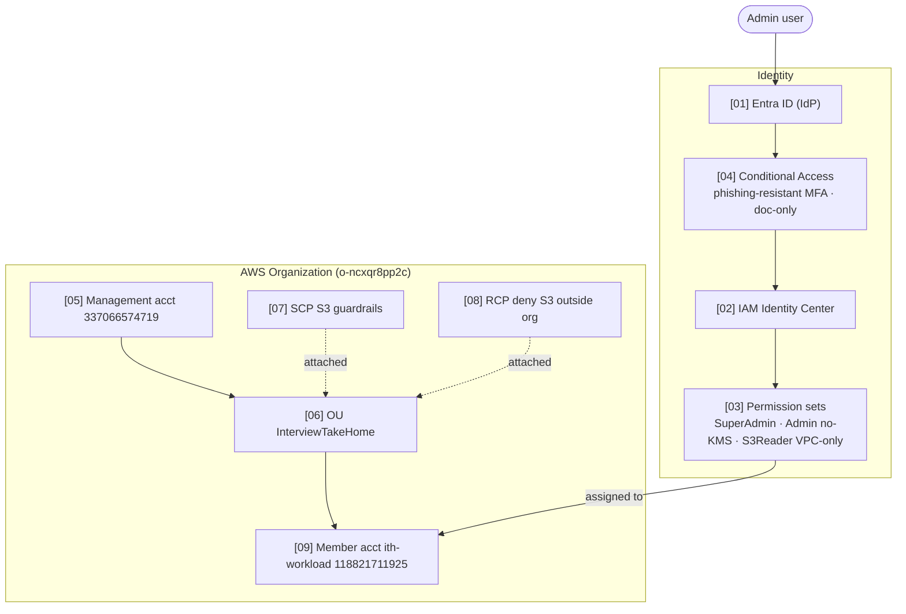
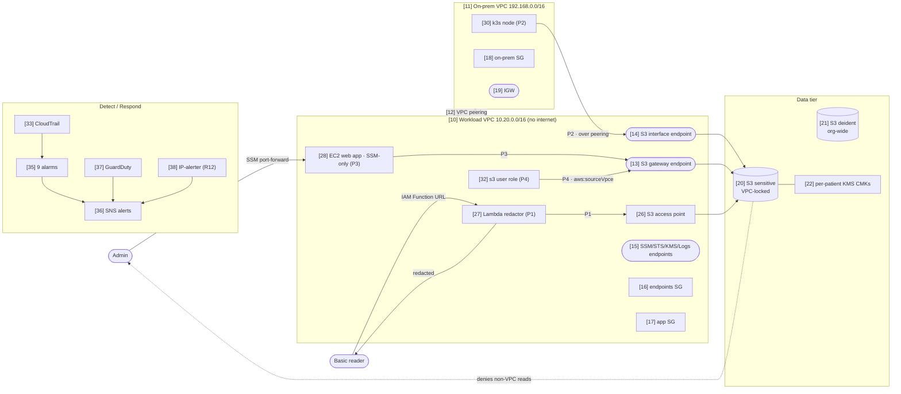

# Securing a Sensitive S3 Resource — AWS + Entra (Take-Home)

## Overview

- **Goal:** secure an S3 bucket of sensitive health data (ePHI) — Prevent / Detect / Respond, assume-breach.
- **Status:** DEPLOYED & VERIFIED in isolated account **`118821711925`** (`ap-southeast-1`). Proof: [`docs/EVIDENCE.md`](docs/EVIDENCE.md).
- **IaC:** 100% Terraform — `terraform/00-org` (org/SCP/RCP), `10-identity` (permission sets), `20-workload` (everything else).
- **Data:** 7 synthetic **Synthea** patients, **vaultless-tokenized**, encrypted with **per-patient KMS keys**.
- **Login (AWS access portal):** **https://d-96677e53fe.awsapps.com/start/**

**The 3 users** (Identity Center permission sets):

| User | Permission set | Scope |
|---|---|---|
| `ith-superadmin` | `ITH-SuperAdmin` | everything (incl. KMS) |
| `ith-admin` | `ITH-Admin` | relevant services, **`Deny kms:*`** |
| `ith-s3` | `ITH-S3Reader` | read S3 **only inside the VPC** (`aws:sourceVpce`) |

> All 3 humans read patient **details only via the EC2 web app** (path P3) — no human has direct `GetObject` on the sensitive bucket. Entra users + Conditional Access are written as IaC but **left disabled** (no-breaking-changes guardrail); see [controls/OutOfScopeNotes.md](controls/OutOfScopeNotes.md).

**Prevent / Detect / Respond (one-liners):**
- **Prevent:** org SCP+RCP, VPC-locked bucket (`aws:sourceVpce`), per-patient KMS, least-privilege roles, phishing-resistant MFA (IdP), SSM-only EC2.
- **Detect:** CloudTrail + GuardDuty + 9 CloudWatch alarms + role-assumption IP alerter.
- **Respond:** disable a per-patient key (one patient dark), revoke creds, quarantine SG, SNS alert.

**4 paths to the sensitive bucket:** P1 Lambda redactor (non-sensitive only) · P2 on-prem k8s over VPC peering · P3 EC2 web app (SSM-only, human path) · P4 `s3` user (VPC-gated).

---

## Architecture

Every box carries a component ID `[NN]` → one controls page in [`controls/`](controls/README.md).

### Identity & governance



### Data plane — network, the 4 S3 paths, KMS, detection



> Editable, detailed draw.io version: [`diagrams/ith-architecture.drawio`](diagrams/ith-architecture.drawio) (4 pages).

---

## Documentation index

| Where | What |
|---|---|
| [`controls/`](controls/README.md) | **one page per component ID** — controls applied to each resource |
| [`controls/OutOfScopeNotes.md`](controls/OutOfScopeNotes.md) | Synthea, hardware-MFA (+ CA API JSON), centralize-root-access, tradeoffs, out-of-scope |
| [`REQUIREMENTS.md`](REQUIREMENTS.md) | requirement → implementation → status matrix |
| [`docs/EVIDENCE.md`](docs/EVIDENCE.md) | live deployment proof (verified calls for all 4 paths + detection) |
| [`diagrams/`](diagrams/) | editable draw.io diagrams |

## Deploy / validate

```bash
cd terraform/00-org    && terraform init && terraform apply   # OU + account + SCP + RCP (mgmt)
cd ../20-workload      && terraform init && terraform apply   # KMS, S3, VPCs, endpoints, EC2, Lambda, detection
cd ../10-identity      && terraform init && terraform apply   # permission sets + owner assignment
pwsh scripts/upload-data.ps1                                  # tokenized data -> S3 (per-patient KMS)
```

**Teardown after verdict:** [`scripts/teardown.md`](scripts/teardown.md) (note the ~90-day account-closure window).

---
*Synthetic data only (Synthea) — no real PHI. Isolated; destroyed after verdict.*
